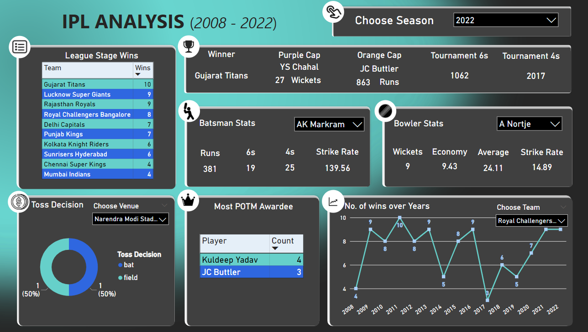

# IPL Data Analysis Dashboard

## Summary
This project aims to analyze IPL (Indian Premier League) match data from 2008 to 2022 to derive insights and visualize various statistics using Power BI. The dataset includes detailed information on matches and ball-by-ball events, enabling a comprehensive analysis of team performances, player statistics, and match outcomes.

## Project Overview
The project involves importing, cleaning, and transforming the raw data to make it suitable for analysis. Using Power BI, we created an interactive dashboard that allows users to explore various aspects of IPL matches, such as team performance, player achievements, and match details across different seasons.

## Data Sources
The dataset used for this analysis is obtained from Kaggle: [IPL 2008 to 2022 All Match Dataset](https://www.kaggle.com/datasets/vora1011/ipl-2008-to-2021-all-match-dataset). The dataset consists of two tables:

1. `Ipl_matches_2008_2022`: Contains columns such as id, city, match_date, season, match_number, team1, team2, venue, toss_winner, toss_decision, superover, winning_team, won_by, margin, method, player_of_match, umpire1, and umpire2.
2. `Ipl_ball_by_ball_2008_2022`: Contains columns such as id, innings, overs, ball_number, batter, bowler, non_striker, extra_type, batsman_run, extras_run, total_run, non_boundary, iswicket_delivery, player_out, dismisal_kind, fielders_involved, and batting_team.

## Cleaning and Transformation
- **Venue Name Standardization:** Replaced 'bengaluru' with 'bangalore' in match venues.
- **Team Name Standardization:** Verified spellings of all team names and corrected 'Rising Pune Supergiants' to 'Rising Pune Supergiant' in all relevant columns.

## Data Analysis
The analysis includes the following features:

1. **Seasonal Slicer:** Allows selection of a specific year from 2008 to 2022 to view statistics for that season.

2. **Final League Stage Wins:** Displays the number of wins for each team in the final league stage of the selected year.

3. **Championship and Player Awards:** Shows the cup winner, Orange Cap winner with runs scored, Purple Cap winner with wickets taken, and total number of 4s and 6s in the tournament.

4. **Player Statistics:** Provides detailed stats for batsmen (total runs, 6s, 4s, strike rate) and bowlers (wickets, economy, average, strike rate). Users can select any player to view their performance.

5. **Toss Decisions:** Displays a donut chart showing the distribution of toss decisions (bat or field) with a slicer for venue selection to understand team preferences at different venues.

6. **Player of the Match Awards:** Lists players who have won the most Player of the Match awards along with the count.

7. **Team Performance Over Years:** A line chart showing the total number of matches won by each team in the league stage over the years. Users can use a slicer to select a specific team.

## Findings
- **Seasonal Insights:** Detailed insights for each IPL season from 2008 to 2022.
- **Team Performance:** Trends in team performances, including league stage wins and championship victories.
- **Player Achievements:** Identification of top-performing players based on runs scored, wickets taken, and Player of the Match awards.
- **Toss Decision Patterns:** Analysis of toss decisions in various venues to determine strategic choices.

## Recommendations
- **Team Strategies:** Teams can use the toss decision patterns to make informed decisions based on venue-specific trends.
- **Player Focus:** Coaches and analysts can focus on key players who consistently perform well, utilizing detailed player statistics.

## Dashboard
