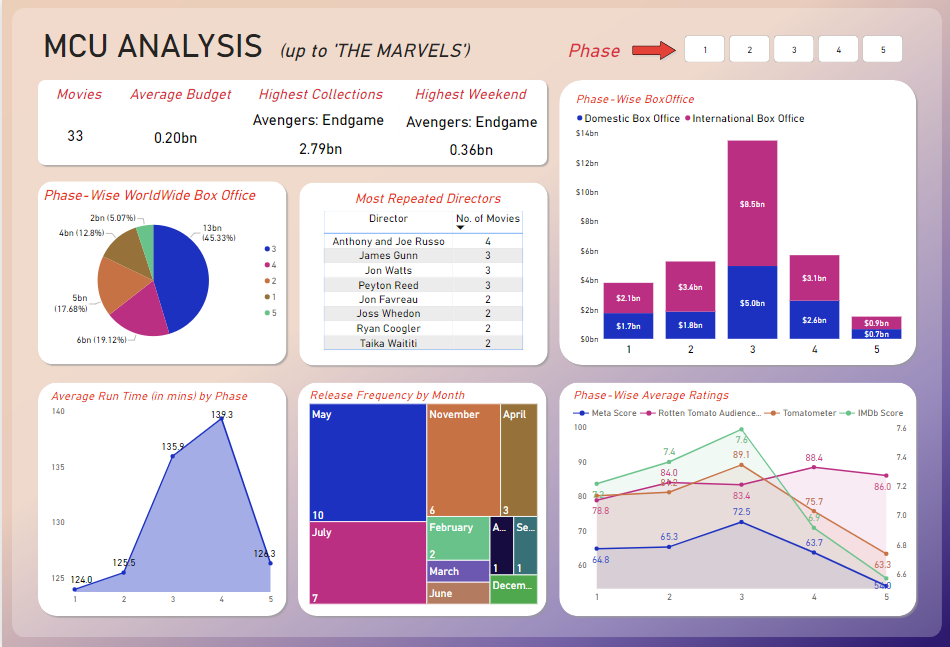

# MCU Analysis (Up to 'The Marvels')

## Summary

This project analyzes the Marvel Cinematic Universe (MCU) movies, focusing on their box office performance, critical reception, and other key metrics. The dataset used contains various details about each MCU movie, including release dates, financial performance, critical scores, runtime, phases, and directors. The analysis aims to provide insights into trends and patterns within the MCU.

## Project Overview

The goal of this project is to provide a comprehensive analysis of MCU movies, examining aspects such as box office collections, budget, critical reception, runtime, and the impact of different phases and directors. The analysis is intended to help understand the factors contributing to the success and characteristics of MCU movies.

## Data Sources

The dataset used for this analysis is sourced from Kaggle:
[Marvel Cinematic Universe Box Office Dataset](https://www.kaggle.com/datasets/monkeybusiness7/marvel-cinematic-universe-box-office)

The dataset includes the following columns:
- Movie
- Release Date
- Domestic Box Office
- Inflation Adjusted Domestic
- International Box Office
- World Wide Box Office
- Opening Weekend
- Budget
- IMDb Score
- Meta Score
- Tomatometer
- Rotten Tomato Audience Score
- Run Time In Minutes
- Phase
- Director

## Cleaning + Transformation

To prepare the data for analysis in Power BI, the following cleaning and transformation steps were performed:

- **Date Conversion**: Converted `Release Date` from `mm/dd/yyyy` format to `dd/mm/yyyy` format using the "Column from Examples" feature.
- **Data Type Conversion**: Changed data types for collection columns (`Domestic Box Office`, `Inflation Adjusted Domestic`, `International Box Office`, `World Wide Box Office`, `Opening Weekend`, `Budget`) from text to whole numbers.
- **Phase Column Standardization**: Converted `Phase` column values from text (e.g., "One", "Two") to numerical values (e.g., 1, 2, ... 5).
- **Runtime Conversion**: Modified `Run Time In Minutes` column from text to integer.

## Data Analysis

### Visualizations

1. **Slicer**
   - A slicer for all 5 phases, allowing users to select multiple phases. The selected filter is applied across all visuals in the report.

2. **KPIs**
   - Total number of movies
   - Average budget
   - Highest collected movie (World Wide Box Office)
   - Highest opening weekend

3. **Box Office Collections**
   - **Phase-wise Box Office Collections**: Stacked column chart showing domestic and international collections.
   - **Pie Chart**: Phase-wise total worldwide box office collections.

4. **Director Analysis**
   - **Table**: Most repeated directors, showing their names and the number of movies they directed.

5. **Runtime Analysis**
   - **Area Chart**: Average runtime vs. phase.

6. **Release Frequency**
   - **Tree Map**: Release frequency per month.

7. **Ratings Analysis**
   - **Phase-wise Average Ratings**: Two-way Y-axis area chart showing IMDb Score, Meta Score, Tomatometer, and Rotten Tomato Audience Score.

## Recommendations

- **Future Budgeting**: Consider correlating the budget with box office performance and critical reception to optimize future movie budgets.
- **Release Timing**: Analyze the monthly release frequency and performance to determine the best release windows.
- **Director Utilization**: Leverage successful directors for future projects based on their past performance.

## Dashboard
