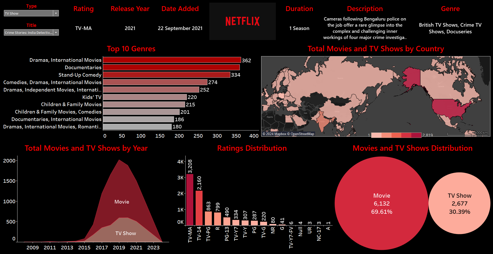

# Netflix Movies and TV Shows Analysis

## Summary
This project analyzes the Netflix Movies and TV Shows dataset to uncover insights related to the content available on the platform. The analysis includes exploring the distribution of genres, the number of shows and movies over the years, country-wise distribution, and rating patterns. The goal is to provide a comprehensive overview of the Netflix library using interactive visualizations in Tableau.

## Project Overview
The objective of this project is to leverage Tableau to analyze the Netflix Movies and TV Shows dataset. By creating various interactive visualizations, we aim to uncover patterns and trends in the Netflix library, such as popular genres, distribution by country, release trends over the years, and rating distributions.

## Data Sources
The dataset used for this analysis is sourced from Kaggle:
[Netflix Movies and TV Shows Dataset](https://www.kaggle.com/datasets/rahulvyasm/netflix-movies-and-tv-shows)

The dataset (`netflix_titles.csv`) includes the following columns:
- **show_id**: Unique identifier for each show
- **type**: Either "Movie" or "TV Show"
- **title**: Title of the show
- **director**: Director of the show
- **cast**: Cast of the show
- **country**: Country where the show was produced
- **date_added**: Date the show was added to Netflix
- **release_year**: Year the show was released
- **rating**: Rating of the show (e.g., PG, R)
- **duration**: Duration of the show (minutes for movies, seasons for TV shows)
- **listed_in**: Genres of the show
- **description**: Brief description of the show

## Cleaning + Transformation
The following data cleaning and transformation steps were performed:
- **Date Conversion**: Set `date_added` and `release_year` columns as date type to ensure proper date-based analysis and visualization.

## Data Analysis

### Visualizations
1. **Filters**
   - **Type Filter**: Allows selection between Movies and TV Shows.
   - **Title Filter**: Allows selection of specific titles based on the chosen type.

2. **Key Metrics**
   - **Rating**: Displays the rating of the selected content.
   - **Release Year**: Shows the release year of the selected content.
   - **Genre**: Displays the genres associated with the selected content.
   - **Date Added**: Shows when the content was added to Netflix.
   - **Duration**: Indicates the duration of movies or number of seasons for TV shows.
   - **Description**: Provides a brief description of the selected content.

3. **Charts**
   - **Row Chart**: Top 10 genres with the number of shows in each genre.
   - **Map Chart**: Countries with color grading based on the number of shows, indicating higher concentration with darker shades.
   - **Area Chart**: Number of shows and movies released each year.
   - **Column Chart**: Distribution of ratings across the Netflix library.
   - **Bubble Chart**: Number of movies and TV shows, represented as bubbles for visual comparison.

## Recommendations
Based on the analysis, here are some recommendations:
- **Content Strategy**: Focus on producing and acquiring more content in the top-performing genres.
- **Regional Content**: Increase investment in regions with fewer shows to diversify the library and attract a global audience.

## Findings
- **Genre Popularity**: Certain genres, such as Dramas and Documentaries, are significantly more prevalent in the Netflix library.
- **Yearly Trends**: There has been a spike in the number of shows and movies added to Netflix in the time period 2018-2020.
- **Rating Patterns**: The distribution of ratings shows trends towards specific audience groups, TV-MA, TV-14.

## Dashboard
